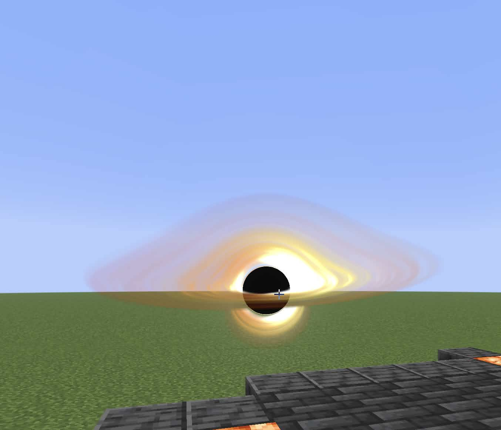
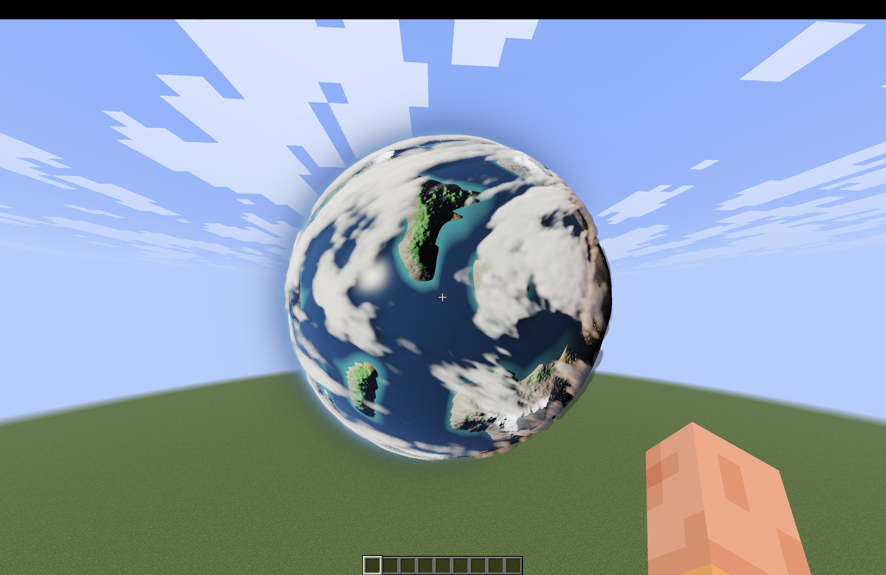
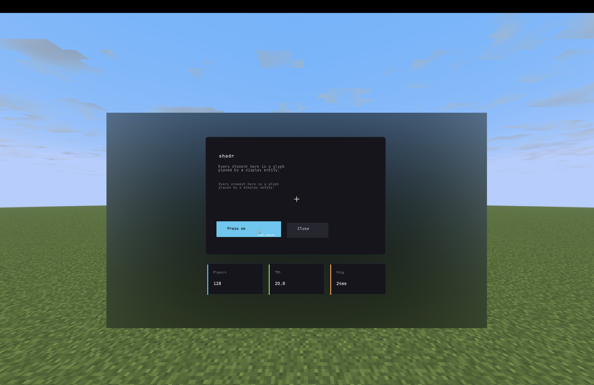

# shadr

[](https://github.com/theDevJade/shadr/actions/workflows/ci.yml)
[](https://github.com/theDevJade/shadr/releases)
[](LICENSE)

shadr uses core shader magic, math, and logic to render UI to vanilla clients. On top of that, shadr is capable of rendering shadertoy-esque shaders as displays entities. This allows custom worldspace objects.

You write a page in YAML, or in the editor:

```yaml
- type: block_rounded
  id: card
  layer: 10.0
  color: 15151c
  position: {x: 1920/2 - 260, y: 1080/2 - 170}
  size: {width: 520, height: 340}
  rounding: {size: regular}
  hoverEffect: lift
  onClickAction:
    - "sound: shadr.click"
    - "message: pressed"
```

## How it works

Essentially, vertex reprojection below a threshold, along with SDF math. Shadr uses custom fonts, core shader overriding, and some real hacky stuff to make everything render.

## Features

- [x] Custom UI
- [x] Custom SDFs for rounded components
- [x] Custom shaders rendering in worldspace
- [x] Custom videoplayer codec and storage-efficient rendering
- [x] Composable screens, and HUD
- [x] Resource pack generation
- [x] Videos, baked and streamed
- [x] 1080p@60fps streamed videos
- [ ] Multi-aspect video support
- [ ] Downscaling videos to match size
- [ ] World-space UI
- [x] Multi-version support: Paper 1.21.6 through 26.2. SDF shapes, text, items, images,
      custom item shaders and frosted-glass blur render on every supported version; video, streaming and the sky, cloud and celestial overrides are 26.2 only
- [x] Improve editor consistency: interaction model improved
      editor those rectangles, so the preview and the game cannot drift apart
- [x] World effects: colour grading, bloom, god rays, SSAO, screen space reflections,
      volumetric fog and a full water surface

## World effects

Toggle these in the editor, or with `/shadr effects`:

    /shadr effects - list everything and its state
    /shadr effects grading - show one effect's settings
    /shadr effects grading enabled true
    /shadr effects grading preset cinematic
    /shadr effects grading exposure 0.15

Grading presets are in `shaders/grading/*.yml`.


## Running it

To run the demo, on MacOS, and Linux atleast use:
    ./run-demo.sh

## On a Paper server

Put the platform-paper jar in plugins/ and start the server.

    /shadr open <page>
    /shadr close
    /shadr reload
    /shadr pages
    /shadr pack
    /shadr update [check|install|cancel]

## Important Notes

Run `./gradlew spotlessApply` for everything, it will throw otherwise.

## AI Notice

Some of this codebase was generated and edited with local AI, mainly the tests. Local AI was also used for debugging and to check my math.

## Screenshots

Both of these are shaders hung in the world as display entities, on a vanilla client with no mods.



\



## Licence

Apache 2.0 - see [LICENSE](LICENSE).

There are core shaders under `shaders/overlays/` that
carry vanilla names are Mojang's, referenced from the client with shadr's hook spliced in. Shadr is not an official Minecraft product and is not approved by or associated with Mojang Studios.